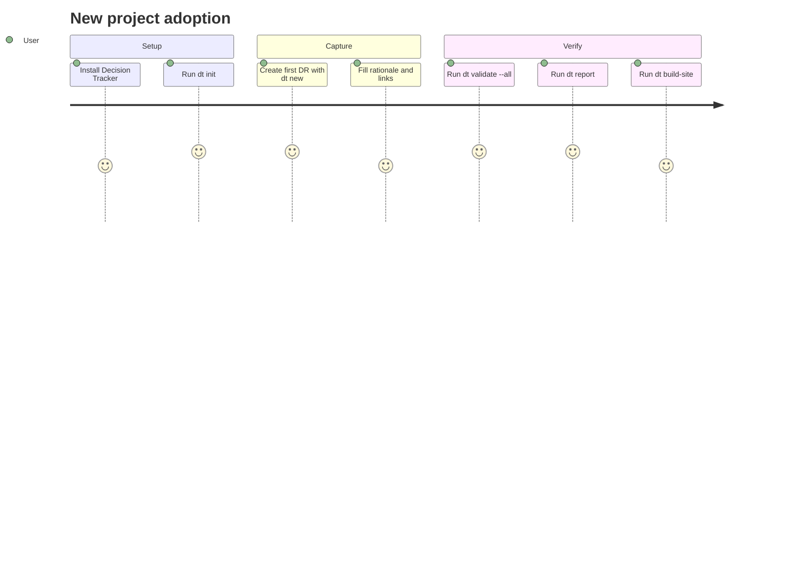
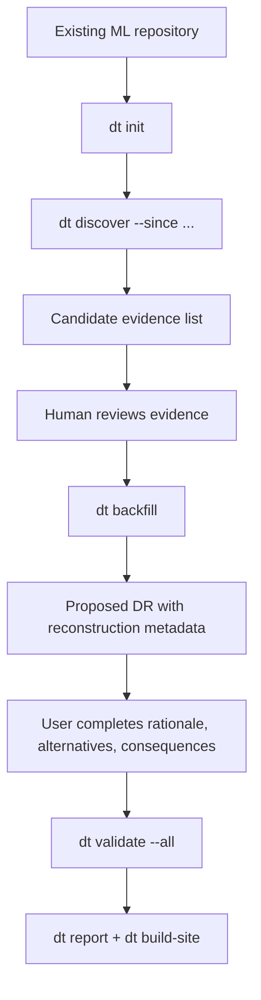
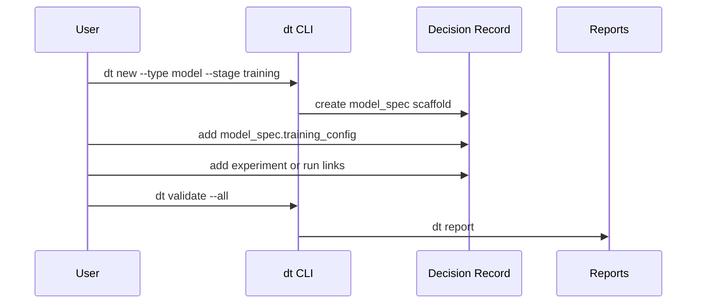
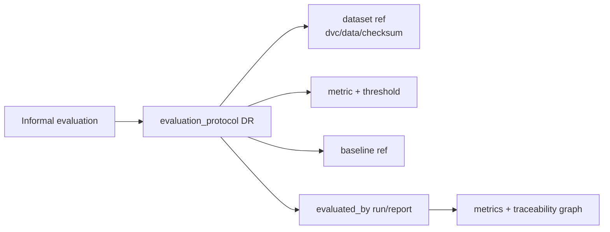
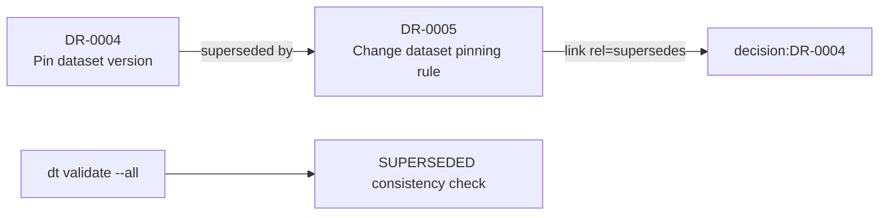
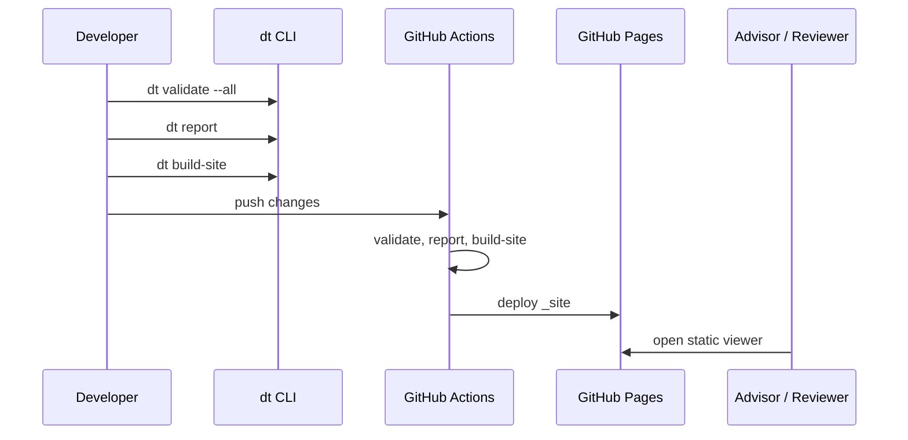
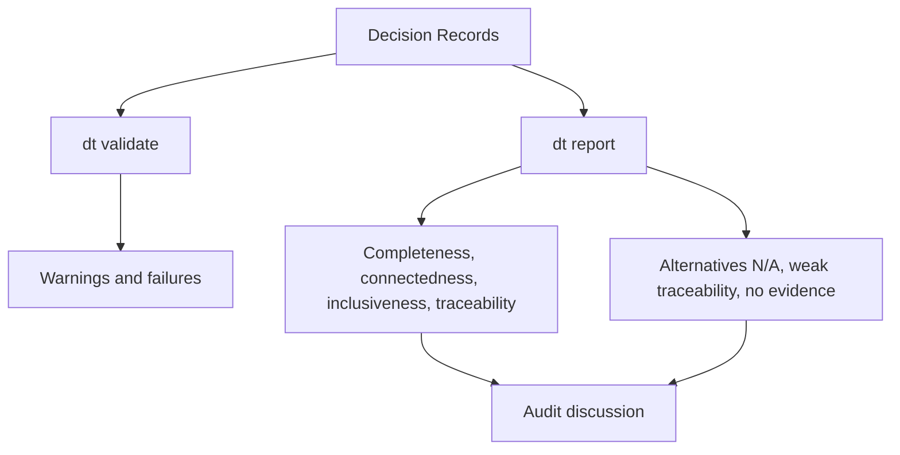
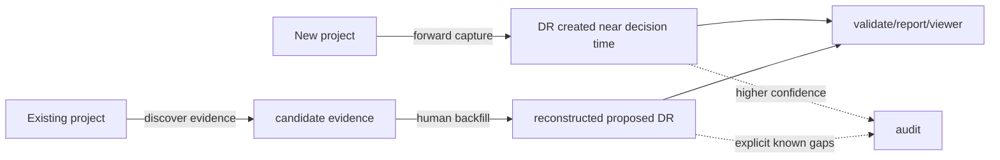

# Decision Tracker User Scenarios

This guide explains how different users apply Decision Tracker in real repositories. It focuses on the interaction flow rather than implementation details.

## Scenario 1: Start Decision Tracking In A New Project

Use this when the team is starting a new ML project and wants to record decisions from the beginning.



Command flow:

```bash
dt init
dt new --title "Choose baseline model" --stage training --type model --owner alice
dt validate --all
dt report
dt build-site
```

Expected outcome:

- the repository gets a `decisions/` directory
- the first Decision Record is created as `proposed`
- generated reports and viewer data are reproducible

## Scenario 2: Backfill Decisions In An Existing Repository

Use this when the model, data pipeline, or evaluation protocol already exists before Decision Tracker is installed.



Key point:

`dt discover` does not extract final decisions. It only finds possible evidence in Git history. `dt backfill` is the trustworthy step because a human confirms the reconstructed decision.

Example:

```bash
dt init
dt discover --since 2024-01-01 --keywords model,baseline,dataset,metric
dt backfill
dt validate --all
```

The generated record includes:

```yaml
reconstruction:
  mode: backfill
  original_decision_date: "unknown"
  evidence_confidence: "medium"
  evidence_sources:
    - git:commit:abc123
  known_gaps:
    - Original meeting notes unavailable
```

## Scenario 3: Record A Fine-Tuning Or Hyperparameter Decision

Use this when a team changes training behavior, not only model architecture.



Example fields:

```yaml
model_spec:
  training_config:
    tuning_method: "random_search"
    search_space:
      learning_rate: "1e-5, 3e-5, 5e-5"
    selected_hyperparameters:
      learning_rate: "3e-5"
    selection_rule: "Choose highest validation F1"
```

Expected outcome:

- the training decision is machine-readable
- tuning evidence can be linked to commits, runs, or docs
- the viewer can show the decision and traceability links

## Scenario 4: Standardize Evaluation

Use this when the team formalizes an evaluation split, metric, threshold, or baseline.



Command:

```bash
dt new --title "Use stratified evaluation split" --stage evaluation --type evaluation_protocol --owner alice
```

Minimum accepted evidence after review:

- dataset link
- evaluation run or report link
- baseline reference
- rationale explaining why the protocol is stable enough

## Scenario 5: Supersede An Older Decision

Use this when a new decision replaces a previous decision.



The new record should contain:

```yaml
links:
  - id: L-0001
    rel: supersedes
    artifact_kind: document
    ref: decision:DR-0004
    label: Replaces earlier dataset pinning rule
```

Expected outcome:

- the old decision can safely move to `status: superseded`
- validation confirms an incoming `supersedes` edge exists
- the graph shows decision evolution over time

## Scenario 6: Publish A Read-Only Viewer

Use this when the team wants a browsable, shareable view of decisions.



Expected outcome:

- users can inspect decisions without installing the CLI
- the viewer uses generated JSON, not a backend
- reports remain available as raw artifacts

## Scenario 7: Audit A Repository

Use this when a reviewer wants to evaluate decision quality.



Useful questions:

- Are important model/data/evaluation decisions recorded?
- Are accepted records linked to evidence?
- Are backfilled decisions clearly marked as reconstructed?
- Are known historical gaps explicit?
- Are superseded decisions connected to their replacements?

## Scenario Comparison



Decision Tracker supports both workflows, but it keeps the distinction visible: live records are captured near the decision moment, while backfilled records are reconstructed from evidence.
